# Hi, I'm Haoran 👋

I build **AI infrastructure on Kubernetes**, focusing on scalable and efficient systems for AI workloads.

- AI inference systems
- Workload scheduling
- AI traffic routing
- Agent platforms

[Blog](https://www.kastanie.top/) · [Email](mailto:kastanie99@qq.com)

## GitHub Stats

  
  

<!--
## Languages

## Frameworks & Tools

+ 

  
+ 

  
+ 

  
+ 

  
+ 

  
+ 

-->

<!-- -->
  
